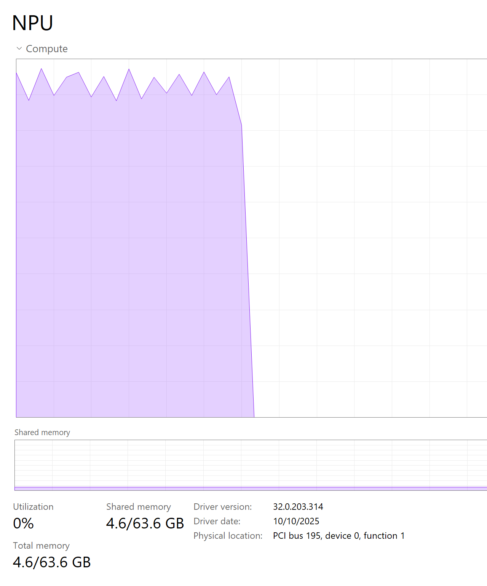

# Setup Record: Framework Desktop (Win)

## Concept Primer

This document records the machine-specific setup state, runtime versions, verification results, and troubleshooting history for `fw-desktop-win`.

### 1. Hardware Inventory

- Machine: Framework Desktop
- CPU: AMD RYZEN AI MAX+ 395
- iGPU: AMD Radeon(TM) 8060S Graphics    
- NPU: AMD Ryzen AI NPU (Strix Halo)
- RAM: 128 GB total, 8000 MT/s
- Storage: 1TB
- Windows power mode: Best performance
- BIOS notes: 03.04

### 2. OS and Driver Versions

- Windows version (build): Windows-11-10.0.26200-SP0
- AMD chipset Software: 7.11.26.2142
- AMD graphics driver: 32.0.23017.1001
- NPU driver / Ryzen AI Software version: 32.0.203.329/Ryzen AI 1.7.0 
- Last verified date (UTC): 2026-03-06

### 3. Runtime and Tooling Versions

- Conda environment: ryzenai170
- Python version: 3.12.11 (conda-forge build)
- onnxruntime version: 1.23.2.dev20260117; pip package variant includes onnxruntime-vitisai wheel
- onnxruntime-genai version: 0.11.2 package family (onnxruntime-genai-directml-ryzenai)
- MLPerf Client version: mlperf-client-1.5.0-8665cb1-windows-x64
- Lemonade version: lemonade-server version 9.4.1
- Ai Analyzer: 1.7.0
- amd-quark: 0.11rc1

### 4. Setup guidance

Download
- Ryzen AI: https://ryzenai.docs.amd.com/en/latest/inst.html  
- Lemonade: https://lemonade-server.ai/install_options.html
- MLPerf Client: https://github.com/mlcommons/mlperf_client/releases
- https://learn.microsoft.com/en-us/windows/ai/npu-devices/

Settings
- Set the Windows power mode to **Best performance**.
- Set the NPU power mode: `xrt-smi configure --pmode turbo`
- Add required environment paths
- If Windows reserves NPU resources, disable **Windows AI Fabric service** as described in [Section 5](#5-issues-and-resolutions)
- If custom ops are required, follow the `custom_ops.dll` notes in [Section 5](#5-issues-and-resolutions)


### 5. Issues and Resolutions

<details>
<summary>Device manager and Drivers issue</summary>

Windows auto update does not catch Bluetooth drivers. Download [Framework Desktop BIOS and Driver Releases](https://knowledgebase.frame.work/en_us/framework-desktop-bios-and-driver-releases-amd-ryzen-ai-max-300-series-BJHcn1Y4gg).

</details>

<details>
<summary>Disable WSAIFabricSvc to free NPU utilization</summary>


Windows initially captures some resources of the NPU. To release them, follow the steps below.

**Via Services Manager:**

1. Press `Win + R`, type `services.msc`, and hit Enter
2. Locate **Windows AI Fabric service** (WSAIFabricSvc) in the list
3. Right-click it, select **Properties**
4. Change "Startup type" to **Disabled**
5. Click **Stop** if the service is running, then click **Apply**
6. Click **OK** to confirm the changes



*Note: Both NPU utilization and memory should show zero after stopping the service.*

</details>

<details>
<summary>Compiling custom_ops.dll (custom ops library)</summary>

```
Install the Microsoft C++ Compiler via Visual Studio.
Open the "x64 Native Tools Command Prompt" as an Administrator.
Activate your Conda environment and run your script directly within this command prompt.
```

After it compiles, you will also need to register the custom ops library when setting up your inference session. You can do this by adding the following to your inference code:

```
from quark.onnx import get_library_path

sess_options = ort.SessionOptions()
sess_options.register_custom_ops_library(get_library_path())
session = ort.InferenceSession(model_path, sess_options, ...) # Add your other parameters here
```

</details>


### 6. Verification Notes

- `xrt-smi examine` summary:
```
System Configuration
  OS Name              : Windows NT
  Release              : 26200
  Machine              : x86_64
  CPU Cores            : 32
  Memory               : 130346 MB
  Distribution         : Microsoft Windows 11
  Model                : Desktop (AMD Ryzen AI Max 300 Series)
  BIOS Vendor          : INSYDE Corp.
  BIOS Version         : 03.04

XRT
  Version              : 2.19.0
  Branch               : HEAD
  Hash                 : 77c7088d804602a53c3eb489b9cb37b709bcd751
  Hash Date            : 2025-12-04 16:52:22
  NPU Driver Version   : 32.0.203.329
  NPU Firmware Version : 1.0.21.44
```

- `xrt-smi validate` summary: 
```
Verbose: Enabling Verbosity
Validate Device           : [xx:xx:xx]
    Platform              : NPU Strix Halo
    Power Mode            : Performance
-------------------------------------------------------------------------------
Test 1 [00c3:00:01.1]     : gemm
    Description           : Measure the TOPS value of GEMM operations
    Details               : Using DPU Sequence
                            Total Duration: 122.7 ns
                            Average cycle count: 222.0
                            TOPS: 51.3
    Test Status           : [PASSED]
-------------------------------------------------------------------------------
Test 2 [00c3:00:01.1]     : latency
    Description           : Run end-to-end latency test
    Details               : Using DPU Sequence
                            Instruction size: 20 bytes
                            No. of iterations: 10000
                            Average latency: 63.2 us
    Test Status           : [PASSED]
-------------------------------------------------------------------------------
Test 3 [00c3:00:01.1]     : throughput
    Description           : Run end-to-end throughput test
    Details               : Using DPU Sequence
                            Instruction size: 20 bytes
                            No. of iterations: 2502
                            Average throughput: 55532.7 ops
    Test Status           : [PASSED]
-------------------------------------------------------------------------------
```